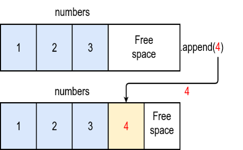

<div align="center">Data Structures and Algorithms in Python</div>

## Binary Search
  ```python
  import timeit

  # Binary Search Index Based =============================
  def binary_search_index_based(arr, target):
      low, high = 0, len(arr) - 1
      
      while low <= high:
          mid = (low + high) // 2
          
          if arr[mid] == target:
              return mid
          elif arr[mid] < target:
              low = mid + 1 # shifts to right half
          else:
              high = mid - 1 # shifts to left half
              
      return -1 

  arr = sorted([1, 3, 5, 3, 2, 5, 23, 5, 65, 43, 7])
  print(binary_search_index_based(arr, 23))

  # Binary Search Slice Based =============================
  def binary_search_slice_based(arr, target):
      if not arr:
          return -1
      mid = len(arr) // 2
      
      if arr[mid] == target:
          return mid
      elif arr[mid] < target:
          result = binary_search_slice_based(arr[mid + 1:], target)
          # index adjustment
          return mid + 1 + result if result != -1 else -1
      else:
          return binary_search_slice_based(arr[:mid], target)
      
  arr = sorted([1, 3, 5, 3, 2, 5, 23, 5, 65, 43, 7])
  print(binary_search_slice_based(arr, 23))


  f_tabu = timeit.timeit("binary_search_index_based(arr, 23)", globals=globals(), number=10000)
  print(f"Binary Search Index Based: {f_tabu:.4f} seconds")
  f_tabu = timeit.timeit("binary_search_slice_based(arr, 23)", globals=globals(), number=10000)
  print(f"Binary Search Slice Based: {f_tabu:.4f} seconds")
  ```
  ```bash
  22
  22
  Binary Search Index Based: 0.0047 seconds
  Binary Search Slice Based: 0.0107 seconds
  ```
- **Index based (low/ high)**: `mid = (low + high) // 2` is a single arithmetic operation, time complexity is ```O(1)```; no matter how big is the array is. `arr[mid]` is also `O(1)`. Python list let you jump outright to any index without touching other elements. 
- **Slice based**:  Python has to physically create new list by copying every element to that list; every recursive call copies a chunk of the list. That’s `O(k)` where k is the sliced list, not `O(1)`. Total copying across all calls sums to `O(n)`, so full time complexity becomes `O(n)` instead of `O(log n)`. 
As, total time complexity for both cases is `O(n log n)`, why execution time differes? This is for searching approach:

|        Approach        | Time per step | Total time | Extra Space |
| :--------------------: | :-----------: | :--------: | :---------: |
| Index-based(low/ high) |     O(1)      |  O(log n)  |    O(1)     |
|   Slicing(arr[:mid])   |   O(k) copy   |    O(n)    |    O(n)     |

So, 
- Index-based:  sort O(n log n)  +  search O(log n) = O(n log n)
- Slice-based:  sort O(n log n)  +  search O(n) = O(n log n)

**Best Case vs worst case:**
# Best Case:

# Find largest prime factor of a given number: time - O(√n); space - O(1)
def largestPrimeFactor(n):
    largestPrime = None
    
    # Strips all factors of two - O(log n)
    while (n % 2 == 0):
        largestPrime = 2
        n //= 2   
        
    # check for odd factors from 3 - O(√n)
    i = 3
    while (i * i <= n):
        while (n % i == 0):
            largestPrime = i
            n //= i
        i += 2
            
    # if n is still greater than 1, it is itself a prime
    if n > 1:
        largestPrime = n 
    return largestPrime
    
print(largestPrimeFactor(13195))


# Worst Case:
  ```python
  def largestPrimeFactor(n):
      largestPrime = None
      
      # check every number from 2 upto √n - O(√n)
      i = 2
      while i * i <= n:
          if n % i == 0:
              # now check if i itself is prime, the worst case - O(√n)
              isPrime = True
              for j in range(2, i): 
                  if i % j == 0:
                      isPrime = False
                      break
              if isPrime:
                  largestPrime = i 
          i += 1
          
      return largestPrime
      
  # total time complexity √n * √n = O(n)
  print(largestPrimeFactor(13195))
  ```

- Linked List → Stack → Queue → Heap → Priority Queue                                          
- Hash Table → Set

## Stacks
A stack is a Last-in, First-out (LIFO) data structure. It's a rule laid on top of an existing structure (array or linked list) that restricts how you're allowed to add/remove things.
- If built on our linked list: push = insert at head (O(1) — no shifting), pop = remove from head (O(1))
- If built on a Python list: push = append() (add to end), pop = .pop() (remove from end)
Stack operation is language-independent:

| Operation              | Python list                 | JavaScript Array           |
| ---------------------- | --------------------------- | -------------------------- |
| Insert/remove at end   | O(1) — append() / pop()     | O(1) — push() / pop()      |
| Insert/remove at front | O(n) — insert(0,x) / pop(0) | O(n) — unshift() / shift() |

**Given that Python list append()/pop() are both O(1), how does python’s list.append() work under the hood?**
Actually, Python's list.append() method has an amortized time complexity of O(1). The average time taken per operation over a series of appends is always constant (O(1)), while the worst-case complexity for a single isolated append can be O(n). 
- Python lists are implemented under the hood as dynamic arrays (contiguous blocks of memory pointers)
- Over-allocation: When we create a list, Python allocates more memory slots than the list currently needs.
- The O(1) Case: Most of the time, the list has empty, pre-allocated slots at the end. Appending simply places the new element pointer into the next available slot and updates the list size counter. This takes constant time.
- The O(n) Case: When the pre-allocated space is completely full, Python must resize the underlying array. It allocates a new, larger block of memory (usually growing exponentially), copies all n existing elements to the new location, and then appends the new element. Copying n elements takes O(n) time.
    
    
            
    [image source: real python]

Python list.pop() can behave exactly like append() with a clean O(1) complexity, but simple nuances while popping from anywhere else - list.pop(i) is O(n)

|         Operation         | Time Complexity |                            Reason                            |
| :-----------------------: | :-------------: | :----------------------------------------------------------: |
|  list.pop() (Last item)   | Amortized O(1)  |         No shifting required; rare memory shrinking.         |
| list.pop(0) (First item)  |      O(n)       |       Every single remaining element must shift left.        |
| list.pop(i) (Middle item) |      O(n)       | All (n – 1) remaining elements after index i must shift left |

**Building stack on python list**:
  ```python
  class UndoStack:
  def __init__(self):
  self.actions = []

  def do(self, action):
  	self.actions.append(action)
  	print(f“Did: {action}”)

  def undo(self):
  	if not self.actions:
  		print(“Nothing to undo”)
  		return
  	last = self.actions.pop()
  	print(f“Undid: {last}”)

  editor = UndoStack()
  editor.do(“typed Hello”)
  editor.do("typed World")
  editor.undo()   # Undid: typed World
  editor.undo()   # Undid: typed Hello
  ```

## Queues

Summary Table:

|    Operation     | JS Array (push/shift) | JS Class (Pointers) | Python List (append/pop(0)) | Pynthon (deque) |
| :--------------: | :-------------------: | :-----------------: | :-------------------------: | :-------------: |
|  Enqueue (Add)   |         O(1)          |        O(1)         |            O(1)             |      O(1)       |
| Dequeue (Remove) |         O(n)          |        O(1)         |            O(n)             |      O(1)       |

